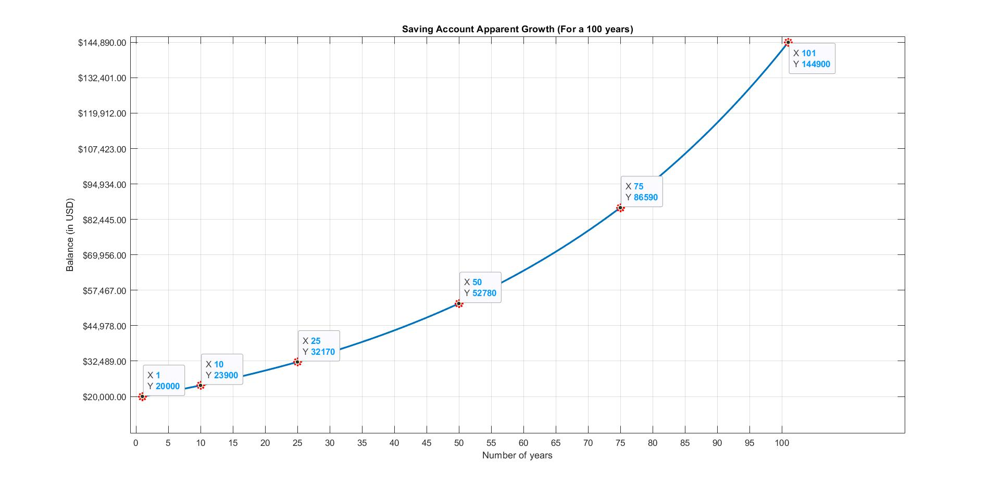
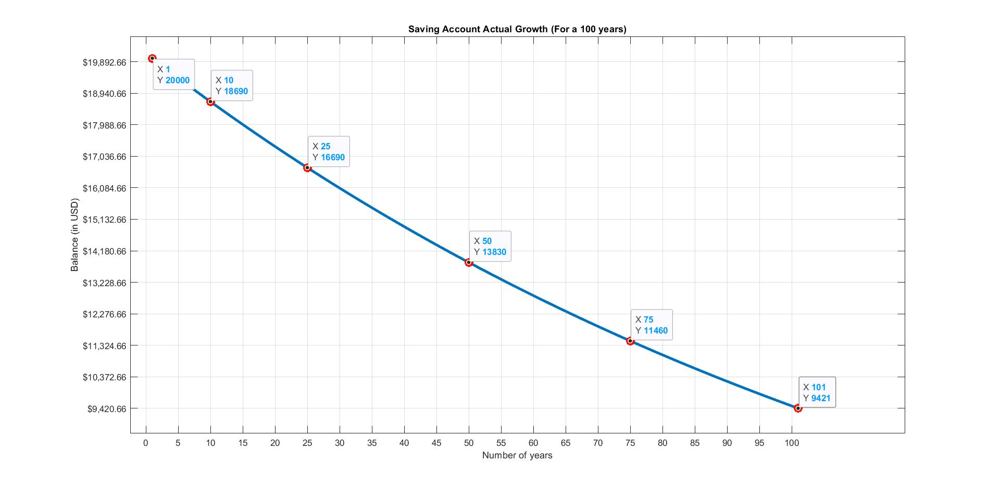
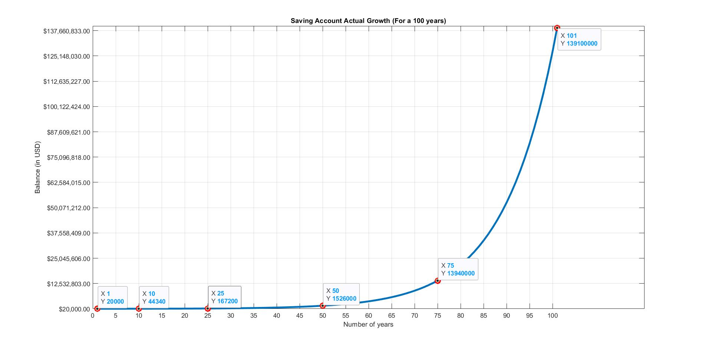

# Savings Account V.S.Mutual Funds

## We can compare the two types of INVESTMENTS by the 👌(three) graphs shown below :- 

### 1.The apparent growth (nominal) rate of savings account [🤑(not)] -

I have plotted the graph for the 'apparent' growth of balance in a savings account (rate is assumed to be = 2%) over the period of 100 years.

This growth may 'seem' promising and the savings account does not look so bad after all. Now I say 'apparent' because, in the calculation of the balance and plotting of the graph we have not considered other factors which may bring down the nominal rate like, inflation and taxes.

### 2.The real growth rate of savings account 🤯 -

I have plotted the graph for the 'real' growth of balance in a savings account over the period of 100 years considering the factor of inflation. We are not considering any other factor such as taxation.

Hence, it can be seen that due to the infaltion rate (assumed to be 2.75%) being higher than the rate of interest of the savings account we actually lose money by investing it in a savings account over a long period of time.  Even if we assume the inflation rate to be equal or a bit less than the rate of interest of the savings account we do not actually grown our money by that great amount. So if saving money is your only motive then the savings account might be an alright bet but, beware you could actually be losing money in most of the cases. Also, as I will explain in the next point investing your money in mutual funds might actually be really beneficial in the long run. 

### 3.The (real) growth rate by investing in Mutual Funds or S.I.P. 🙌 -

Here I have plotted the graph of your portfolio balance (rate is assumed to be 12%) over the period of 100 years. I have also factored in the same inflation rate (2.75%) to plot the graph.

NOW THIS IS EXPONENTIAL GROWTH OF WEALTH. This is very impressive. Now it is true that this way of investing money is a bit risky hence, it is advised not to invest all your savings in a single stock or only in the stock market or only in mutual funds. Some money must be set aside in a savings account (as an emergency fund) always. The amount in this fund should be enough to get you through 6-8 months and cover all your expenses for that amount of time atleast. Now you can learn a lot via the internet and great investment books and by doing just a little bit of hard work and research you can set up your own portfolio and get amazing returns from it. This growth of your wealth can allow you to retire early and live in a tree house somewhere in a hill station. The possibilities are unlimited and sky is the only limit. So BEGIN investing right away.

!! WARNING !! - This is a personal project and is meant only for educational and entertainment purposes and you are not obliged to follow any of this.

### PEACE.

# SPIRIT OUT >>>> >>
